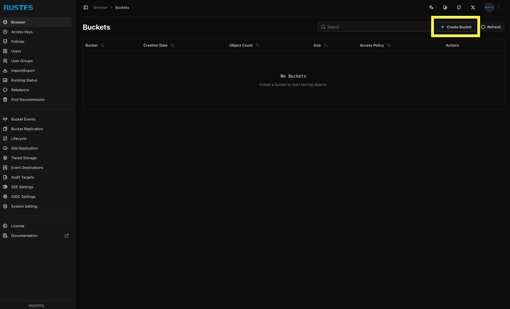
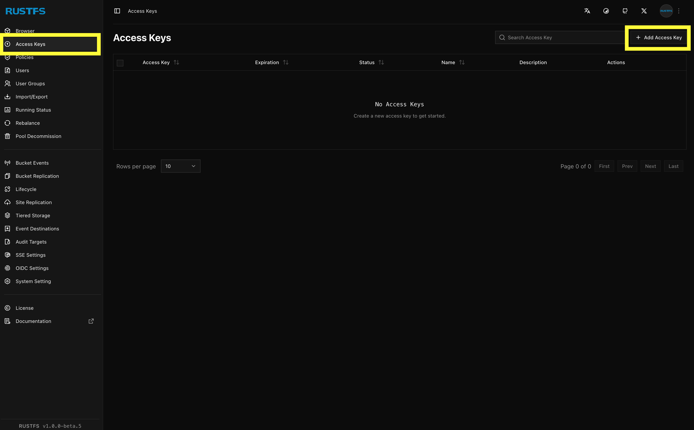
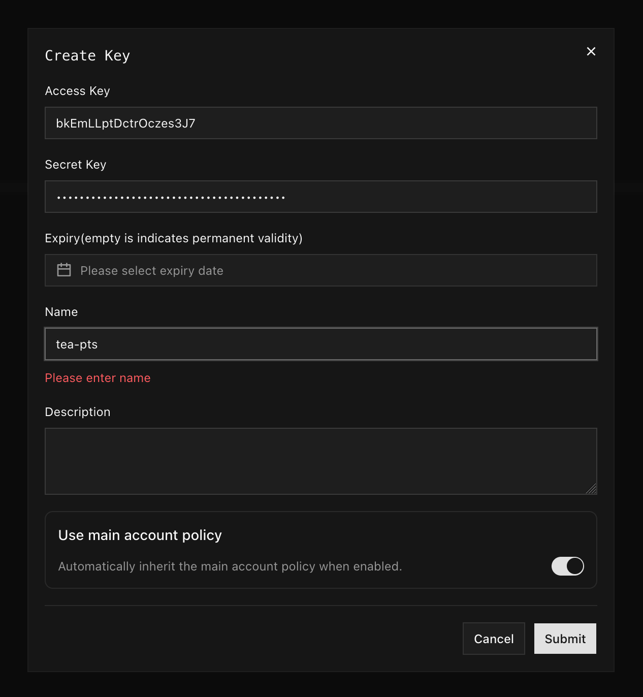
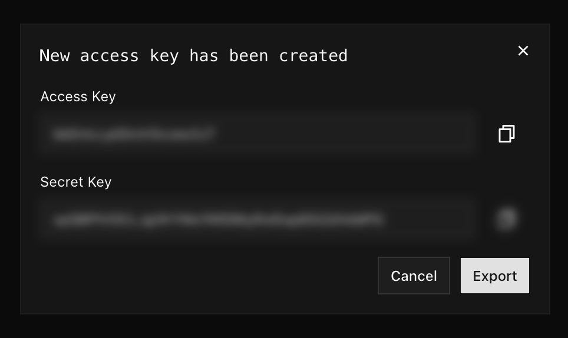

# Guia de Desenvolvimento

Para desenvolver novas features desse sistema, é essencial conhecer a filosofia por trás dos arquivos e linhas
de códigos existentes, bem como as ferramentas utilizadas. Nesse guia, você aprenderá como configurar seu
ambiente de desenvolvimento, descobrirá com quais tecnologias estará em contato e aprenderá como o sistema
está estruturado.

- [Objetos (de domínio) e Arquitetura](./objetos-e-arquitetura.md)
- [Configuração do Ambiente de Desenvolvimento]

## Dependências

O servidor do TEA-PTS depende de alguns serviços externos, como _blob storages_ e bancos de dados. Durante o
desenvolvimento, utilizamos Docker para levantar instâncias desses serviços localmente sempre que possível.

Em alguns casos, os serviços necessários são proprietários e se urge uma alternativa local. Nesses cenários,
as considerações concernentes ao substituto escolhido serão exploradas em tópicos nesse documento ou em outro
— aqui referenciados.

### RustFS

É uma alternativa open-source ao AWS S3 — que é proprietário e não provê meios de ser utilizado localmente.
No geral, todo serviço que se vende como uma alternativa ao AWS S3 implementa sua interface, ou seja, são
compatíveis entre si. Desse modo, não é exigido que o RustFS seja o verdadeiro _blob storage_ em produção.

#### Configurando

Após levantar o contâiner do RustFS, acesse o dashboard em http://localhost:9001. O login é aquele definido
no arquivo de variáveis de ambiente. (Se você ainda não levantou o contâiner ou não preparou as variáveis de
ambiente, refira-se ao documento [Configuração do Ambiente de Desenvolvimento].)

Acessando o painel, clique no botão "Create Bucket" e crie dois _buckets_ (não é necessário nenhuma
configuração sofisticada em desenvolvimento, basta colocar um nome e criar): um para os documentos dos
prontuários dos pacientes, outro para fotos de perfil enviadas pelos usuários do sistema.

As variáveis de ambiente `DOCUMENTS_BUCKET` e `PROFILE_PICTURES_BUCKET` devem ser preenchidas com os
respectivos nomes.

<figure>
    
    <figcaption>Figura 1: tela inicial do RustFS</figcaption>
</figure>
  

Navegue até a aba "Access Keys" e clique em "Add Access Key" no canto superior direito da tela (Figura 2).
Adicione um nome à chave (preencha o campo "Name") e clique em "Create" (Figura 3). Copie o valor "Access
Key" e "Secret Key" para as variáveis de ambiente `BLOB_STORAGE_ACCESS_KEY` e `BLOB_STORAGE_SECRET_KEY`,
respectivamente. (Vide Figura 4.)

<figure>
    
    <figcaption>Figura 2: tela de gerenciamento de tokens de acesso</figcaption>
</figure>
  

<figure>
    
    <figcaption>Figura 3: formulário para criar uma nova chave de acesso</figcaption>
</figure>
  

<figure>
    
    <figcaption>Figura 4: chave de acesso criada</figcaption>
</figure>
  

Veja mais detalhes no [repositório do RustFS](https://github.com/rustfs/rustfs).

[Configuração do Ambiente de Desenvolvimento]: ./configurações-do-ambiente.md
